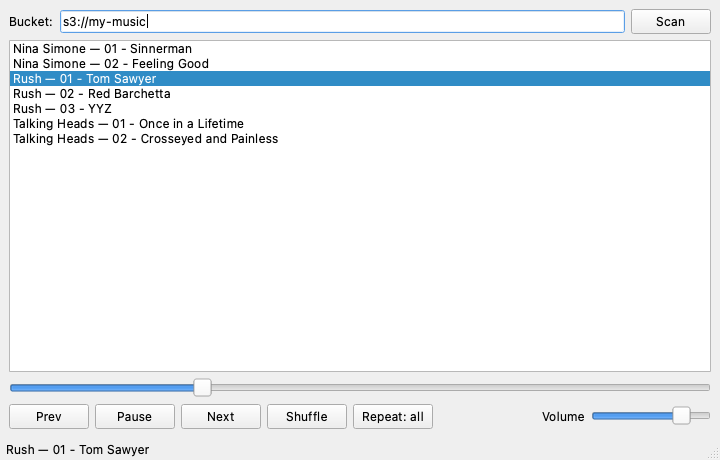

# s3_music_player

[](https://github.com/mflood/s3_music_player/actions/workflows/tests.yml)

Find the music sitting in your S3 buckets, and play it.

If you have been backing things up to S3 for years, there is probably an
album's worth of audio in there that no client can see. This scans a bucket for
audio files and either prints them — as plain URIs, JSON, or an M3U playlist
you can hand to another player — or plays them itself in a small desktop app.



## Quick start

```bash
pip install -r requirements.txt          # scanner only
pip install -r requirements-gui.txt      # scanner + player

python -m s3music buckets
python -m s3music scan my-music
python -m s3music play s3://my-music
```

Credentials come from the usual boto3 places — environment, `~/.aws/config`,
instance role. `--profile` and `--region` are there when you need them.

## Scanning

```
$ s3music scan my-music
s3://my-music/Nina Simone/Pastel Blues/01 - Sinnerman.flac
s3://my-music/Rush/Moving Pictures/01 - Tom Sawyer.mp3
s3://my-music/Rush/Moving Pictures/02 - Red Barchetta.mp3
```

Narrow it with a prefix and emit a playlist:

```
$ s3music scan my-music --prefix "Rush/" --format m3u
#EXTM3U
#EXTINF:-1,01 - Tom Sawyer
s3://my-music/Rush/Moving Pictures/01 - Tom Sawyer.mp3
#EXTINF:-1,02 - Red Barchetta
s3://my-music/Rush/Moving Pictures/02 - Red Barchetta.mp3
```

Or get the metadata:

```
$ s3music scan my-music --format json --limit 1
[
  {
    "uri": "s3://my-music/Nina Simone/Pastel Blues/01 - Sinnerman.flac",
    "bucket": "my-music",
    "key": "Nina Simone/Pastel Blues/01 - Sinnerman.flac",
    "title": "01 - Sinnerman",
    "size": 4096,
    "etag": "20439f79e4e9dc95be34b21029221f80"
  }
]
```

A bucket name, an `s3://bucket` URI, or an `s3://bucket/prefix` all work.

## Playing

`s3music play` opens the window above: scan a bucket, double-click a track,
and use the transport controls. Shuffle keeps your current track playing and
rearranges everything around it; repeat cycles off → all → one.

Tracks are downloaded to `~/.cache/s3music` before playing rather than
streamed, so replaying a track costs nothing. Cache filenames are the SHA-256
of the S3 URI, not the key — object keys are arbitrary strings, and a key like
`../../../.ssh/authorized_keys` must not be able to write outside the cache
directory. There is a test for exactly that.

## As a library

```python
import boto3
from s3music import S3MusicScanner, Playlist

scanner = S3MusicScanner(boto3.client("s3"))
tracks = list(scanner.scan("s3://my-music", prefix="Rush/"))

playlist = Playlist(tracks)
playlist.shuffle(seed=1)          # seeded, so it is reproducible
playlist.next()
```

`scan()` is a generator over a boto3 paginator, so the first track arrives
without waiting for a bucket of 100,000 objects to finish listing.

## Design

The reason this is laid out the way it is: **GUI code is hard to test, so
almost none of the behaviour lives in the GUI.**

```
   scanner.py ──┐
                ├──▶ PlayerController ──▶ AudioBackend (a protocol)
   cache.py ────┤           │                     ▲
                │           │                     │
   playlist.py ─┘           │             ┌───────┴────────┐
                            ▼        QtAudioBackend    FakeBackend
                      PlayerWindow    (the real app)   (the tests)
```

`PlayerController` holds every rule worth getting right — resume without
re-downloading, advance at end of track, skip a track that will not download,
ignore a stray end-of-media signal after an explicit stop — and reaches the
sound card only through a six-method `AudioBackend` protocol. The tests
substitute a fake backend and drive all of it with no display, no sound card
and no event loop.

What is left in `PlayerWindow` is wiring: a button click calls a controller
method, a controller callback updates a widget. That thin layer *is* tested,
against Qt's `offscreen` platform, so CI catches a signal connected to a
method that no longer exists — but it is not where the logic hides.

| Module | Responsibility |
|---|---|
| `s3music/track.py` | A track's identity: URI parsing, title, display name |
| `s3music/scanner.py` | Paginated bucket listing, filtered by extension |
| `s3music/cache.py` | Safe local download cache |
| `s3music/playlist.py` | Order, cursor, shuffle, repeat |
| `s3music/player.py` | Playback rules and the `AudioBackend` protocol |
| `s3music/qt/` | Qt backend and window — the only Qt-aware code |
| `s3music/cli.py` | `buckets`, `scan`, `play` |

## Tests

```bash
pip install -r requirements-dev.txt
QT_QPA_PLATFORM=offscreen PYTHONPATH=.:tests python -m pytest tests -v
```

121 tests. S3 is mocked with `moto`, so the suite drives a real boto3 client
against a fake service — pagination past the 1000-key page limit, missing
buckets, and empty responses all get exercised for real rather than stubbed
out. CI runs on Python 3.11 and 3.12.

The screenshot above is generated, not staged: `make_screenshot.py` builds the
real window offscreen against a mocked bucket and grabs the pixels.

## History

Written in 2019–2022 and left as a scratchpad. The entry point had an
unterminated string literal, so `qt_main.py` had not parsed in years; the
scraper imported a `mylogging` module that was never committed; the same
160-line file existed twice under different names; and an unrelated book
cataloguing app had been dropped in alongside it. Rebuilt in 2026 around the
one good idea — S3 as a music library — with the playback logic pulled out to
where it can be tested.

The scanner picked up two real fixes on the way through. It used the deprecated
`list_objects` with a hand-rolled marker loop that raised `KeyError` on any
bucket with no matching objects, and `make_s3_client` built a `kwargs` dict
then assigned into an undefined `args`, so passing an explicit access key
raised `NameError`.

## License

Apache 2.0 — see [LICENSE](LICENSE).
